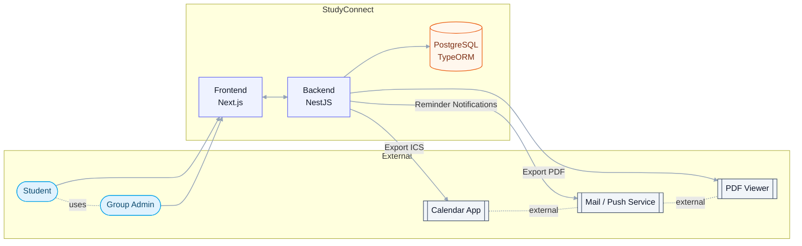
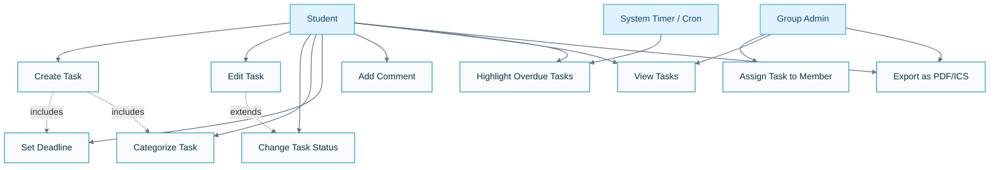

# StudyConnect – System Context Diagram

## Overview
The following diagram illustrates the main actors and external systems that interact with the StudyConnect application.  
It also highlights the internal architecture layers (frontend, backend, database), aligned with the 3-tier model used in this project.

Explanation

Frontend: Provides the user interface for students and admins to manage tasks and groups.
Backend: Contains business logic, validation, authentication, role-based access, and scheduled jobs (e.g., marking overdue tasks).
Database: Stores users, groups, tasks, comments, and notifications.
External Services:
Calendar apps (Google, Apple, Outlook) receive ICS exports.
PDF viewers display exported task summaries.
Mail or push services send non-disruptive reminders.
Actors:
Student: Creates and manages personal and group tasks.
Group Admin: Manages memberships, assigns tasks, moderates activities.

---

markdown
# StudyConnect – Use Case Diagram (Task Management)

## Scope
This diagram focuses on the **Task Management** feature of StudyConnect, which enables students to create, update, and track tasks individually or within groups.

Description
Primary actor: Student
Secondary actors: Group Admin, System Timer (Cron)
Goal: Efficient management of personal and group study tasks with visibility of deadlines and progress.
Includes: Setting deadlines and categories during task creation.
Extends: Editing tasks includes changing status.

---

markdown
# StudyConnect – Use Case Descriptions

---

## UC-01: Create Task
**Primary Actor:** Student  
**Goal:** Create a new task with title, category, priority, notes, and optional deadline.  
**Preconditions:** User is authenticated.  
**Postconditions:** Task is persisted and visible in the user’s or group’s list.  

### Main Success Scenario
1. Student opens “Create Task”.
2. Enters title (mandatory).
3. Optionally sets category, priority, deadline, and notes.
4. Confirms creation.
5. System validates data and saves the task.
6. Confirmation message and task overview are displayed.

### Extensions
- 2a. Missing title → error message.  
- 4a. Deadline in the past → warning, user must confirm or change date.  
- 5a. Network error → retry suggestion or local draft.  

---

## UC-03: Change Task Status
**Primary Actor:** Student  
**Supporting Actor:** System Timer (Cron)  
**Goal:** Update the task’s progress state (open, in progress, completed, overdue).  
**Preconditions:** Task exists, user has permission.  
**Postconditions:** New status saved, UI and filters updated.

### Main Success Scenario
1. User opens a task.
2. Chooses new status.
3. System validates and updates the task.
4. UI refreshes, showing updated badge or filter.

### Extensions
- 2a. Invalid transition → warning.  
- 3a. No permission → “Forbidden”.  
- 5a. Cron automatically marks task as overdue if `dueAt < now` and status ≠ completed.  

---

## UC-09: Assign Task to Group Member
**Primary Actor:** Group Admin  
**Goal:** Assign an existing task to a specific group member.  
**Preconditions:** User has admin role and group membership exists.  
**Postconditions:** Task shows assigned member; optional reminder created.

### Main Success Scenario
1. Admin opens group task.
2. Selects member to assign.
3. System validates permissions.
4. System updates assignment and saves.
5. UI displays the assigned member.

### Extensions
- 3a. Not an admin → “Forbidden”.  
- 2a. Member not in group → prompt to invite first.  

---

## UC-10: Export as PDF/ICS
**Primary Actor:** Student  
**Goal:** Export tasks as calendar or printable overview.  
**Preconditions:** Tasks exist, user has read access.  
**Postconditions:** Exported file successfully downloaded.

### Main Success Scenario
1. User selects export option and filters (e.g. group, timeframe).
2. System generates PDF or ICS.
3. File is downloaded or opened.

### Extensions
- 2a. No tasks found → info message.  
- 3a. Import failure (ICS) → user guidance message.  
