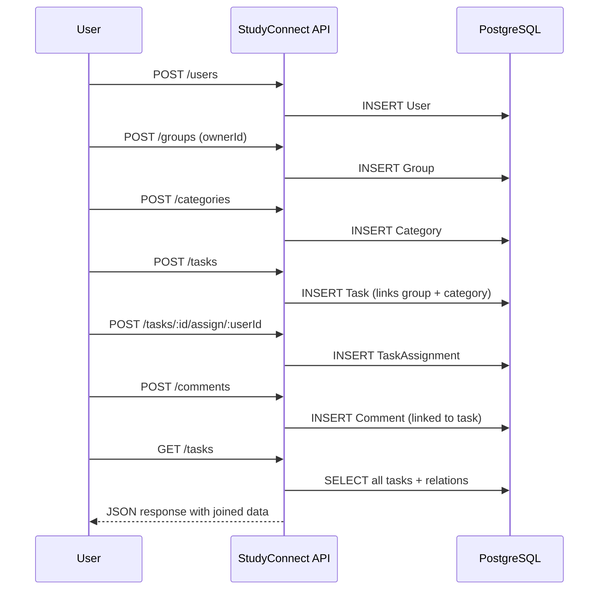

#  Core Domain Model Implementation 

Functional backend of **StudyConnect**, implementing the core domain logic and APIs for task management, group collaboration, and commenting.  
All services, controllers, and data models are fully integrated through NestJS + TypeORM + PostgreSQL.

---

## Overview
The system enables students to create tasks, form study groups, and collaborate efficiently.  
This iteration (4.2) focuses on implementing and verifying core features via **end-to-end (e2e)** testing.

### Core Modules
- **Users** – create and manage users.
- **Groups** – study groups with owners and members.
- **Tasks** – assignable, categorized tasks with progress status.
- **Categories** – organizational tags for tasks.
- **Comments** – task and group discussion threads.
- **Gamification** – achievements and points (stubbed for now).
- **Health** – simple liveness and readiness checks.

---

## Technologies
| Layer | Stack |
|-------|--------|
| Backend Framework | NestJS 10 + TypeScript |
| ORM | TypeORM |
| Database | PostgreSQL (Docker container) |
| Tests | Jest + Supertest (for e2e) |
| Environment | Node 20 +, npm 10 + |

---

## Setup & Execution

### 1) General Setup
Same process as in [`projectSetup-environmentConfiguration.md`](./projectSetup-environmentConfiguration.md), installation of requirements, clone repository, run the docker container, install dependencies of the project and create de .env

### 2) Run the server
```bash
cd apps/api
npm start
```
The API will be available at  
 `http://localhost:3001`

---

## Testing

### End-to-End (E2E) Tests
Run for testing the API:
```bash
cd apps/api
npm run test:e2e -- core-flow.e2e-spec.ts
```

Expected output → All endpoints return 2xx and models synchronize correctly.

---

## System Flow Diagram (Mermaid)



