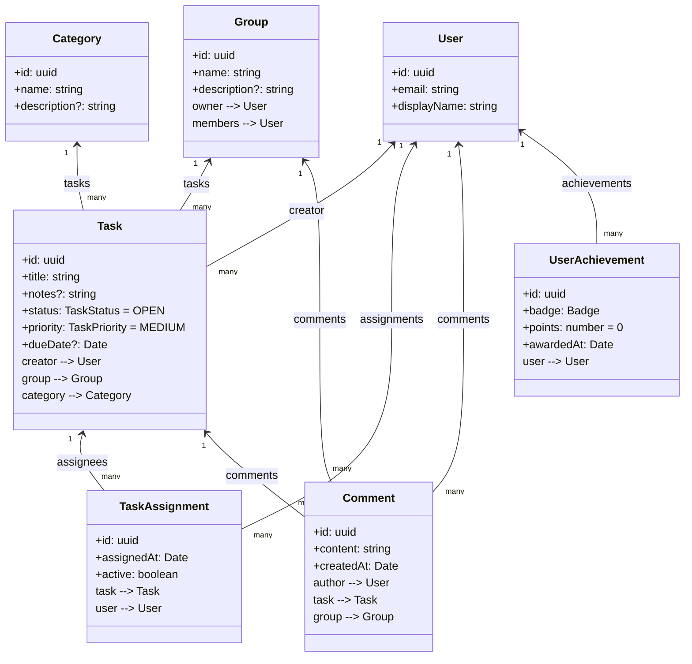

# Unit Testing the Domain Models
Validation of entity behavior _in isolation_ (no database, no HTTP), covering constructors/defaults, simple relationships, and business helpers.

---

## What’s covered
Unit tests for the following entities:
| Entity | Test file | Key assertions |
|---|---|---|
| **Task** | [`src/tasks/task.entity.spec.ts`](../../apps/api/src/tasks/task.entity.spec.ts) | Defaults (`status=OPEN`, `priority=MEDIUM`), valid/invalid status transitions, overdue calculation |
| **Group** | [`src/groups/group.entity.spec.ts`](../../apps/api/src/groups/group.entity.spec.ts) | Owner presence, members collection management |
| **Category** | [`src/categories/category.entity.spec.ts`](../../apps/api/src/categories/category.entity.spec.ts) | Name/description shape |
| **Comment** | [`src/comments/comment.entity.spec.ts`](../../apps/api/src/comments/comment.entity.spec.ts) | Author is required, link to either `task` or `group` |
| **TaskAssignment** | [`src/tasks/task-assignment.entity.spec.ts`](../../apps/api/src/tasks/task-assignment.entity.spec.ts) | Links `task` + `user`, default `active=true` (and `assignedAt` shape if checked) |
| **UserAchievement** | [`src/gamification/user-achievement.entity.spec.ts`](../../apps/api/src/gamification/user-achievement.entity.spec.ts) | Badge enum values, default points = 0, user linkage |
| **User** | [`src/users/user.entity.spec.ts`](../../apps/api/src/users/user.entity.spec.ts) | Email/displayName shape |

> These are **in-memory** tests: defaults set at the entity level are checked without hitting the DB layer.

---

## Files added/edited (relative paths)
```
apps/api/
├─ src/
│  ├─ tasks/
│  │  ├─ task.entity.ts                     # entity with in-memory defaults
│  │  └─ task.entity.spec.ts
│  ├─ groups/
│  │  ├─ group.entity.ts
│  │  └─ group.entity.spec.ts
│  ├─ categories/
│  │  ├─ category.entity.ts
│  │  └─ category.entity.spec.ts
│  ├─ comments/
│  │  ├─ comment.entity.ts
│  │  └─ comment.entity.spec.ts
│  ├─ gamification/
│  │  ├─ badge.enum.ts
│  │  ├─ user-achievement.entity.ts
│  │  └─ user-achievement.entity.spec.ts
│  └─ users/
│     ├─ user.entity.ts
│     └─ user.entity.spec.ts
```

---

## How to run
From the backend directory:
```bash
cd apps/api

# Unit & service/controller tests (no server needed)
npm test
```

---

## 🧭 Domain Relationships (Mermaid)
