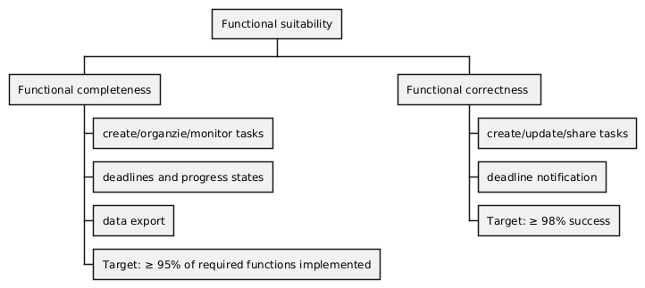
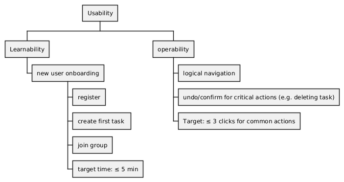
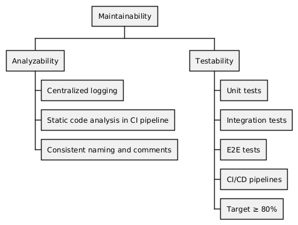

# 2.1 Functional System Requirements (FSR)

## 1. Individual Task and Goal Management

These requirements cover the personal planning and tracking features for a single student's workload.

| **ID**  | **Requirement**                                                                                               | **Source**        |
| :------ | :------------------------------------------------------------------------------------------------------------ | :---------------- |
| FSR-I.1 | The system must allow a user to create a new task.                                                            | Task Creation     |
| FSR-I.2 | The system must allow the user to assign the following core attributes: Title, Deadline, Priority, and Notes. | Task Attributes   |
| FSR-I.3 | The system must allow the user to organize tasks into thematic categories (e.g., "Mathematics," "Exam Prep"). | Task Organization |
| FSR-I.4 | The system must allow the user to update a task's progress state (open, in progress, completed).              | Progress Tracking |
| FSR-I.5 | The system must allow the user to edit (modify attributes) and delete existing tasks.                         | Task Manipulation |

## 2. Group Collaboration and Role Management

These requirements focus on the shared planning, communication, and administration within study groups.

| **ID**  | **Requirement**                                                                                                              | **Source**       |
| :------ | :--------------------------------------------------------------------------------------------------------------------------- | :--------------- |
| FSR-G.1 | The system must allow a user to create a new study group and automatically be designated as the Administrator.               | Group Creation   |
| FSR-G.2 | The system must allow a user to join an existing study group.                                                                | Group Membership |
| FSR-G.3 | The Group Administrator must be able to invite members to the group and moderate/manage memberships.                         | Admin Control    |
| FSR-G.4 | The system must allow members to create group tasks that are visible to all members within that group.                       | Group Tasks      |
| FSR-G.5 | The Group Administrator must be able to assign group tasks to specific group members.                                        | Task Assignment  |
| FSR-G.6 | The system must provide a built-in commenting/messaging function that links discussions directly to the relevant group task. | Communication    |

## 3. Time Management, Notifications, and Motivation

These requirements ensure users are aware of their commitments and remain engaged.

| **ID**  | **Requirement**                                                                                                            | **Source**       |
| :------ | :------------------------------------------------------------------------------------------------------------------------- | :--------------- |
| FSR-Z.1 | The system must clearly display the deadlines for both individual and shared group activities.                             | Deadline Display |
| FSR-Z.2 | The system must highlight overdue tasks and prominently display upcoming activities in the task overview.                  | Awareness        |
| FSR-Z.3 | The system must be able to generate supportive reminders/notifications for upcoming deadlines.                             | Notifications    |
| FSR-Z.4 | The system must integrate motivational elements (e.g., progress points or badges) upon the successful completion of tasks. | Motivation       |

## 4. Data Management and Integration

These requirements ensure the application supports the user's broader academic workflow.

| **ID**  | **Requirement**                                                                                                                                          | **Source**     |
| :------ | :------------------------------------------------------------------------------------------------------------------------------------------------------- | :------------- |
| FSR-D.1 | The system must allow the user to export their plans and schedules in PDF format Or in ICS calendar file format for integration with external calendars. | PDF/ICS Export |

# 2.2 Quality model

After some discussions, we agreed on the following four quality attributes of ISO 25010 that are the most important ones for our StudyConnect project.

- functional suitability
- usability
- maintainability
- performance efficiency

The most important quality attribute is functional suitability. This includes functional completeness as well as functional correctness of the required functions of StudyConnect.

Another important aspect is usability, to be able to achieve specific goals in an effective and efficient manner. Part of this is learnability, so that the user can quickly get used to the layout and processes of our StudyConnect app. It is also important that the most relevant functions can be accessed quickly and intuitively.

To ensure the performance of StudyConnect we decided to include performance efficiency as a criteria. This implies time-related behaviour like loading times and duration of certain operations as well as the appropriate use of system resources.

The last attribute is maintainability with its sub characteristics analyzability and testability. The former to make it easier to identify the causes of failures and the latter to guarantee that the implemented features can be verified through (automated) testing.

## Measures for testability

One can implement several measures to guarantee testability during the development of StudyConnect.

The first and most important one is automated testing: With an automated CI pipeline and the use of different testing strategies (unit tests, integration tests, E2E tests) one can ensure that each commit will be checked on its impact on the basic functions of StudyConnect.

A modular architecture will be adopted separating interfaces, logic and data layers to enable isolated unit testing.
To ensure reproducibility, a dedicated test environment will be used.

Furthermore, structured logging as well as the use of naming conventions and coding guidelines will improve testability by making it easier to trace errors.

These measures can ensure that test criteria can be defined clearly and that tests can be executed effectively and efficiently.

# 2.3 System Context & Use Cases

Here you can see the system context diagram for the StudyConnect app:

## Use-case Diagramm (Task management)

This use case diagram explains how the user can interact with the tasks:

## Use-cases

The explicit use cases can the found in the `use-cases` folder.
