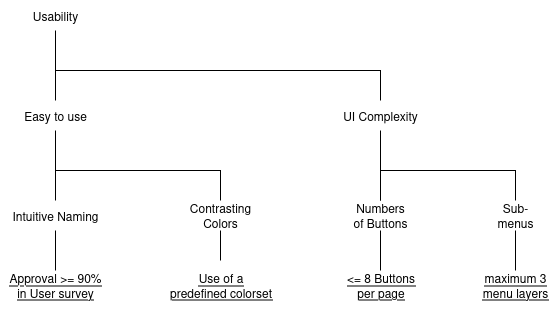
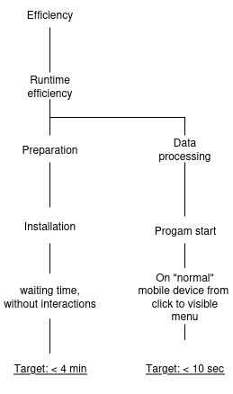
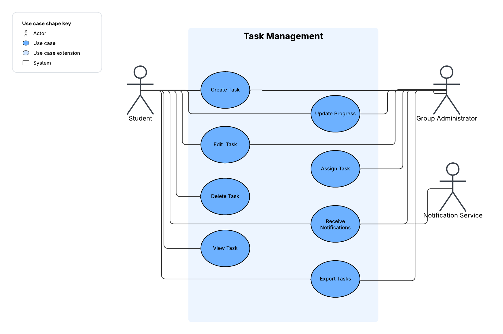

<p align="center"><b><font size="7">Dokumentation Studyconnect</font></b></p>
<p align="center"><b><font size="6">Gruppe 4</font></b></p>

### Architektur


<p align="center">
  <em>Strukturdiagramm</em>
</p>

<p align="center">
  Abbildung 1: Strukturdiagramm. <em>Erstellt mit <a href="https://draw.io">draw.io</a></em>
</p>


#### Angular (Frontend)

Angular bietet eine umfangreiche Sammlung integrierter Funktionalitäten wie Routing, Formularverarbeitung, HTTP-Client und State Management. Diese ermöglichen eine strukturierte und effiziente Entwicklung auch bei komplexen Anwendungen. Die klare Architektur sowie die strikte Trennung von Komponenten fördern sowohl die Wartbarkeit als auch die Skalierbarkeit des Systems.

Ein wesentlicher Vorteil liegt in der hohen Modularität: Durch wiederverwendbare Komponenten können dynamische Benutzeroberflächen einfacher und konsistenter entwickelt werden. Zusätzlich lässt sich Angular flexibel mit externen Bibliotheken und Abhängigkeiten erweitern, was den Funktionsumfang individuell anpassbar macht.

Angular wird aktiv von Google weiterentwickelt und als Open-Source-Projekt bereitgestellt. Dadurch profitieren Entwickler von einer kontinuierlichen Weiterentwicklung, einer umfangreichen Dokumentation und einer großen Community, die Hilfestellungen und Best Practices bereitstellt.

Ein weiterer Grund für die Wahl von Angular war die vorhandene Erfahrung im Team. Einige Mitglieder hatten bereits praktische Kenntnisse in Angular, was die Einarbeitungszeit deutlich reduziert.

##### Vorteile von TypeScript

Angular basiert auf TypeScript, einer von Microsoft entwickelten Erweiterung von JavaScript. TypeScript bietet statische Typisierung sowie moderne Sprachfeatures, die über den Standard von JavaScript hinausgehen. Dadurch wird eine höhere Codequalität erreicht, da viele Fehler bereits während der Entwicklungszeit erkannt werden. Das Debugging gestaltet sich dadurch effizienter, und die Wartung des Codes wird langfristig erleichtert.

TypeScript fördert zudem eine bessere Strukturierung von größeren Projekten. Dank Interfaces, Typdefinitionen und Klassenorientierung lassen sich komplexe Anwendungen übersichtlicher aufbauen und erweitern.

#### Spring Boot (Backend)

Für das Backend fiel die Wahl auf Spring Boot. Das Framework ermöglicht die schnelle und effiziente Entwicklung von REST-APIs, über die das Angular-Frontend mit den benötigten Daten versorgt wird.  

Die Architektur von Spring Boot ist klar strukturiert und folgt dem Schichtenmodell:  
- **Controller**: nimmt Anfragen entgegen und leitet sie weiter  
- **Service**: enthält die zentrale Geschäftslogik  
- **Repository**: kapselt den Zugriff auf die Datenbank  

Diese Trennung fördert eine saubere Code-Struktur und erleichtert die Wartung sowie Erweiterbarkeit der Anwendung.  

Spring Boot bietet zudem eine enge Integration mit Spring Data JPA, wodurch Datenbankzugriffe stark vereinfacht werden. Standard-CRUD-Operationen lassen sich ohne großen Implementierungsaufwand realisieren. Für komplexere Anforderungen können individuelle Methoden flexibel ergänzt werden.  

Ein weiterer Vorteil liegt in der großen Community und dem breiten Ökosystem von Spring. Dadurch stehen zahlreiche Erweiterungen und Bibliotheken zur Verfügung, die den Entwicklungsprozess beschleunigen und gleichzeitig die Stabilität der Anwendung sicherstellen.

#### PostgreSQL (Datenbank)

PostgreSQL hat sich als führender Open-Source-Konkurrent zu einem weit verbreiteten relationalen Datenbankmanagementsystem (DBMS) etabliert. 
Es bietet umfassende Funktionen wie die Unterstützung von JSON-Daten, Volltextsuche und benutzerdefinierten Datentypen. Zudem zeichnet es sich durch enorme Skalierbarkeit aus und ist sowohl für kleine als auch für sehr große Datenbanken geeignet. 
Durch die hohe ACID-Konformität gewährleistet es eine ausgezeichnete Datenintegrität und Transaktionssicherheit, während die engagierte Community kontinuierlich neue Funktionen und Updates bereitstellt.

### Projektmanagment

Für das Projektmanagement setzen wir auf das **GitHub-Kanban-Board**, auf dem alle Aufgaben, Features und sonstigen Angelegenheiten als Issues erfasst werden. Teammitglieder weisen sich Issues selbständig zu.

Die Entwicklung erfolgt auf *Feature-Branches*, die jeweils einem bestimmten Issue zugeordnet sind. Sobald ein Feature fertiggestellt ist, wird der Branch in `main` gemerged. Dabei wird in der Commit- oder Merge-Nachricht das zugehörige Issue verlinkt, sodass automatisch nachvollziehbar ist, welches Issue dadurch abgeschlossen wurde.

Die sonstige Kommunikation im Team läuft über einen Discord-Server, auf dem Rückfragen, Abstimmungen und Diskussionen zu Aufgaben stattfinden. So bleibt die Zusammenarbeit strukturiert, und alle Teammitglieder können jederzeit den aktuellen Stand einsehen.

### Funktionale Anforderungen

- Benutzer können persönliche Aufgaben erstellen, bearbeiten, löschen und kategorisieren.
- Aufgaben können mit Titel, Frist, Priorität und Notizen versehen werden.
- Nutzer können parallel mehrere Lernziele verwalten und deren Fortschritt überblicken.
- Unterstützung individueller und Gruppen-Aufgabenverwaltung: persönliche Aufgaben planen und in kleinen Studiengruppen zusammenarbeiten.
- Nutzer können Gruppen erstellen, beitreten, Mitglieder einladen und Aufgaben zuweisen.
- Rollen- und Rechteverwaltung zur Unterscheidung von Mitgliedern und Administratoren mit klarer Aufgabenverteilung und Gruppenmoderation.
- Aufgabenbezogene Kommunikation: Kommentarfunktionen und Messaging zur engen Verzahnung von Diskussion und Arbeit.
- Aufgaben und Gruppenaktivitäten sind an bestimmte Termine gebunden mit Hervorhebung von anstehenden und überfälligen Fristen.
- Unterstützende, nicht aufdringliche Erinnerungen und Benachrichtigungen.
- Export von Aufgabenplänen und Zeitplänen als PDF oder Kalenderdatei (ICS).
- Zugriff und Nutzung über Webbrowser auf verschiedenen Endgeräten (PC, Tablet, Smartphone) sowie mobile Nutzung.
- Fortschrittsstatus für Aufgaben (offen, in Bearbeitung, erledigt) zur Unterstützung von Priorisierung und Zeitmanagement.
- Gamification-Elemente wie Fortschrittspunkte oder Abzeichen zur Motivation, ohne vom Lernziel abzulenken.

### Nicht-funktionale Anforderungen

- **Simplicity and Usability:** Intuitive, logische Benutzeroberfläche, die schnelle, einfache Bedienung ohne Schulungsbedarf ermöglicht.
- **Accessibility:** Plattformübergreifende Zugänglichkeit auf Web, Mobile und potenziell Desktop, inklusive Barrierefreiheit.
- **Reliability:** Hohe Verfügbarkeit und Stabilität, mit Fehlertoleranz und Verlässlichkeit im Betrieb.
- **Maintainability:** Modularer Designansatz für erweiterbare und wartbare Architektur.
- **Performance:** Schnelle Ladezeiten und reaktionsfähige Bedienung, auch bei höheren Benutzerzahlen.
- **Security:** Schutz der Nutzerdaten sowie sichere Authentifizierung und Zugriffskontrolle.
- **Testability:** Klare Modulgrenzen und Schnittstellen zur einfachen Testdurchführung.
- **Portability:** Plattformübergreifende Nutzbarkeit sowie leichte Integration in bestehende Lern-Workflows durch Exportisierung.
- **Integration:** Unterstützung zukünftiger Integration mit externen Lernplattformen und institutionellen Systemen.
 
### Quality Model

#### 4 major Quality aspects

- Usability


<p align="center">
  <em>Usability quality model</em>
</p>

- Security


<p align="center">
  <em>Security quality model</em>
</p>

- Portability


<p align="center">
  <em>Portability quality model</em>
</p>

- Efficiency


<p align="center">
  <em>Efficiency quality model</em>
</p>


#### Quality aspect of testability

- Tests von Anfang an mit in den Code einbringen.
- Kritische Funktionen auf Testbarkeit prüfen und für bessere Testbarkeit modifizieren falls möglich.
- Lauffähige Applikations-Versionen während der Entwicklung starten und testen.

### Systemkontext-Diagramm
Das Systemkontext-Diagramm stellt die wichtigsten Interaktionen zwischen dem StudyConnect-System und anderen Systemen oder Akteuren dar.


<p align="center">
  <em>Systemkontext-Diagramm</em>
</p>

### Use-Case-Diagramm
Basierend auf der Funktion "Task Management" wird folgendes Use-Case Diagramm zur visuellen Veranschaulichung dargestellt. 


<p align="center">
  <em>Use-case-Diagramm</em>
</p>

Die Use-Case Beschreibung für dieses Diagramm kann unter dem Ordner use-cases gefunden werden.

### Die Anwendung starten

#### Installation der erforderlichen Voraussetzungen für das Backend

Kurzübersicht — Was installiert werden sollte

- Java Development Kit (JDK) 21
- Apache Maven (alternativ: Maven Wrapper, siehe weiter unten)
- Docker CLI und Docker Compose (empfohlen, erleichtert das Aufsetzen einer lokalen Datenbank)

Hinweis: Statt Docker kann auch eine bestehende Datenbank verwendet werden, dann müssen jedoch manuelle Anpassungen an der Konfiguration vorgenommen werden (siehe Abschnitt „Alternative: eigene Datenbank verwenden“). Diese Option wird nicht empfohlen.

Schritte (high-level)

1. JDK 21 installieren

  - Installieren Sie ein Java Development Kit in der Version 21 (z. B. Temurin, OpenJDK, Azul). Stellen Sie sicher, dass es sich um ein JDK (nicht nur eine JRE) handelt.
  - Setzen Sie anschließend die Umgebungsvariable `JAVA_HOME` auf den Installationspfad und fügen Sie die `bin`-Unterordner zum `PATH` hinzu (Windows: Systemeigenschaften → Umgebungsvariablen).

2. Apache Maven (oder Maven Wrapper)

  - Installieren Sie Apache Maven, oder verwenden Sie den im Projekt vorhandenen Maven Wrapper. Der Wrapper (`mvnw` / `mvnw.cmd`) erlaubt es, das Projekt zu bauen, ohne Maven systemweit zu installieren.

3. Docker (empfohlen)

  - Installieren Sie die Docker-CLI und Docker Compose (unter Windows typischerweise über Docker Desktop). Das ist empfohlen, da das Projekt eine PostgreSQL-Datenbank benötigt und Docker-Compose das lokale Starten einer Datenbank stark vereinfacht.

4. Projekt-Ordner und Build

  - Öffnen Sie eine Eingabeaufforderung oder PowerShell und wechseln Sie in das Verzeichnis `backend`, in dem sich die `pom.xml` befindet.
  - Führen Sie dort einen Build aus, z. B. mit dem Maven Wrapper oder Ihrer systemweiten Maven-Installation:

    - Auf Windows mit Wrapper: `mvnw.cmd install`
    - Oder mit installiertem Maven: `mvn install`

Alternative: eigene Datenbank verwenden (nicht empfohlen)

- Falls Sie Docker nicht verwenden möchten, können Sie eine externe PostgreSQL-Datenbank zur Verfügung stellen. In diesem Fall müssen Sie die Datenbankverbindungsdaten (URL, Benutzername, Passwort) in der Anwendung konfigurieren.
- Passen Sie die `.env`-Datei im Ordner backend an, sowie gegebenenfalls die Datei(en) `src/main/resources/application.properties` (oder `application-dev.properties`), damit die Anwendung die richtige Datenbank erreicht. Achten Sie auf die korrekten JDBC-URL-Formate und auf die Übereinstimmung der verwendeten Ports.

#### Starten des Backends

Führen Sie die folgenden Schritte im Verzeichnis `backend` aus, nachdem Sie die Voraussetzungen installiert haben:

1. Kopieren Sie die Beispieldatei `.env.example` und legen Sie eine lokale `.env`-Datei an (diese enthält Umgebungsvariablen und kann bei Bedarf angepasst werden).

   - Beispiel (PowerShell):

     ```powershell
     Copy-Item .env.example .env
     ```

   - Beispiel (Unix / Bash):

     ```sh
     cp .env.example .env
     ```

2. Starten Sie die Anwendung mit Maven:

   - Mit installiertem Maven:

     ```sh
     mvn spring-boot:run
     ```

   - Oder mit dem Projekt-Maven-Wrapper (Windows):

     ```powershell
     .\mvnw.cmd spring-boot:run
     ```

Hinweis: Beim ersten Start lädt Maven die benötigten Abhängigkeiten herunter; falls Sie Docker verwenden, werden auch die benötigten Images gezogen. Der erste Start kann deshalb mehrere Minuten dauern. Warten Sie, bis in den Logs steht, dass die Anwendung erfolgreich gestartet wurde (z. B. eine Zeile mit "Started StudyconnectApplication").

Falls die Anwendung keine Verbindung zur Datenbank herstellen kann, prüfen Sie zunächst:

- Ob Docker Desktop (bei Verwendung von Docker) läuft und die DB-Container gestartet sind.
- Ob die Einstellungen in der `.env`-Datei und gegebenenfalls in `src/main/resources/application.properties` korrekt sind (JDBC-URL, Benutzer, Passwort, Ports).

### Starten von Tests im Backend

Die Tests laufen lokal standardmäßig gegen eine H2 In-Memory-Datenbank. Die Konfiguration befindet sich in `backend/src/main/resources/application-test.properties`.

Führen Sie alle implementierten Tests mit `mvn test` aus, alternativ mit `.\mvnw.cmd test`.

### Test-Cases

#### `UserRepositoryTest` (Kurzbeschreibung)

Die Klasse `UserRepositoryTest` enthält mehrere JPA-Tests für die `UserRepository`-Schnittstelle. Die Tests laufen mit dem Spring-Profile `test` (H2 In-Memory-DB) und verwenden `@DataJpaTest` zur Isolation der Repository-Ebene.

- `shouldCreateAndSaveUserWithValidData` — prüft, dass ein gültiger `User` gespeichert werden kann und dass Felder wie `id`, `email`, `surname` und `lastname` korrekt gesetzt sind.
- `shouldFailToSaveUserWhenEmailIsNull` — erwartet eine `DataIntegrityViolationException`, wenn `email` null ist (NOT NULL Constraint).
- `shouldFailToSaveUserWhenSurnameIsNull` — erwartet eine `DataIntegrityViolationException`, wenn `surname` null ist.
- `shouldFailToSaveUserWhenLastnameIsNull` — erwartet eine `DataIntegrityViolationException`, wenn `lastname` null ist.
- `shouldFailToSaveUserWhenCreatedAtIsNull` — erwartet eine `DataIntegrityViolationException`, wenn `createdAt` null ist.
- `shouldFailToSaveUserWithDuplicateKeycloakUUID` — legt einen User mit einer `keycloakUUID` an und prüft, dass das Anlegen eines zweiten Users mit derselben UUID aufgrund der Unique-Constraint fehlschlägt.

Diese Tests verifizieren sowohl erfolgreiche Persistenz als auch Datenbank-Constraints (NOT NULL, UNIQUE) auf Repository-Ebene.

#### `TaskRepositoryTest` (Kurzbeschreibung)

Die Klasse `TaskRepositoryTest` enthält mehrere JPA-Tests für die `Task`-Entity und das zugehörige `TaskRepository`.
Die Tests laufen mit dem Spring-Profile `test` (H2 In-Memory-DB) und verwenden `@DataJpaTest` zur Isolation der Repository-Ebene.

- `shouldCreateAndSaveTaskWithValidData` — prüft, dass eine gültige `Task`-Instanz gespeichert werden kann; Validierung von Default-Feldern wie `priority` (MEDIUM) und `status` (OPEN) sowie automatische `createdAt`-Setzung durch JPA-Lifecycle-Callbacks.
- `shouldEnforceTitleNotNull` — erwartet eine `DataIntegrityViolationException`, wenn `title` null ist (NOT NULL Constraint für die Task-Titelspalte).
- `shouldManageAssigneesAndTagsAndRelationships` — prüft die `@ManyToOne`-Beziehung `createdBy` zum `User`, die `@ManyToMany`-Beziehung `assignees` sowie die `@ElementCollection` `tags`. Testet zusätzlich die Helper-Methoden `addAssignee`, `removeAssignee`, `addTag`, `removeTag`.
- `shouldSupportStatusTransitionAndMarkComplete` — prüft die Statusübergänge, insbesondere die Helper-Methode `markComplete()` und die Aktualisierung von `updatedAt`.
- `shouldDetectOverdue` — validiert die Geschäftslogik `isOverdue()` für überfällige Aufgaben (vor/nach dem Abschluss) anhand von in der Vergangenheit liegenden `dueDate`-Werten.
- `shouldManagePriorityDefaultAndUpdates` — überprüft, dass der Standardwert für Priorität `MEDIUM` ist und dass Prioritätsänderungen (z. B. auf `HIGH`) korrekt persistiert werden.

Diese Tests dokumentieren die erwarteten Verhalten der `Task`-Entity (Persistenz, Constraints, Beziehungen und Domänenlogik) und dienen als Referenz für spätere Integrationstests und Implementierungen der Service/Controller-Schicht.


