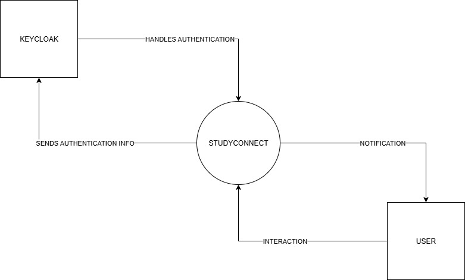
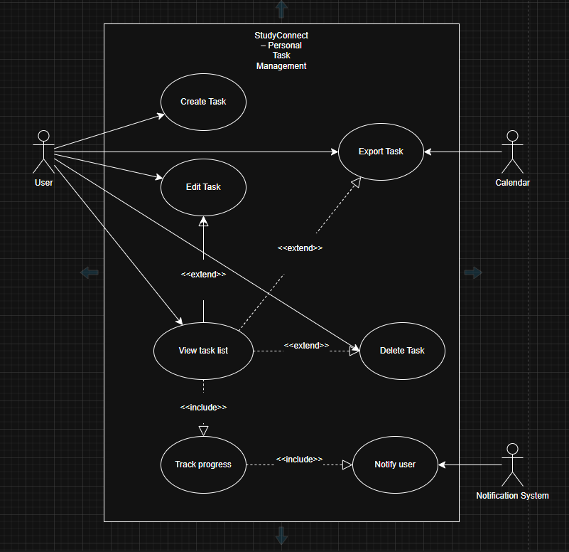

# System Context Diagramm

Here you can see a system context diagramm for the StudyConnect app:

# Use-case Diagramm (Task management)

This use case diagramm explains how the user can interact with the tasks:

